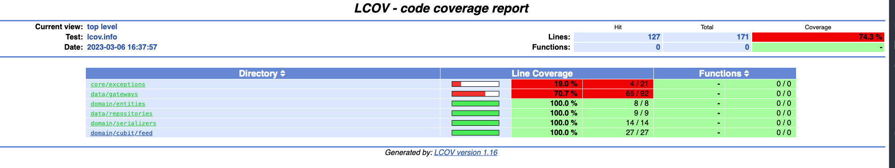

# Clean Cubit
## Introduction

Clean Cubit is a project that demonstrates a clean implementation of Cubit using a Clean Architecture approach. This project showcases how to structure and organize your code to make it scalable, maintainable, and easy to understand.

# Getting Started
## Flutter

If you're new to Flutter or need help installing and running it locally, you can refer to the [_Get started_](https://flutter.dev/docs/get-started/install) guide

Once you have Flutter set up on your local machine, navigate to the project's root folder and install the dependencies using the command
`flutter pub get`.

# Architecture
### Overview
Clean Cubit follows the principles of [Clean Architecture](https://blog.cleancoder.com/uncle-bob/2012/08/13/the-clean-architecture.html) as proposed by Robert C. Martin (Uncle Bob). The benefit of this approach is that it is widely recognized in the community and provides scalability.

The project's folder structure is as follows:

 - `presentation`: contains all the UI elements (widgets)
 - `domain`: handles the business logic, state management, and makes the respective calls to the `data` layer
 - `data`: retrieves and modifies any data without the knowledge of any other layers
 - `core`: contains shared functionalities for all layers.

### Tests
  
This project includes unit tests for the core layers to ensure that the functionality works correctly. To run the tests with coverage, follow these steps:

 -  `brew install lcov`
 -  `flutter test --coverage`
 -  `genhtml coverage/lcov.info -o coverage/html`
 -  `open coverage/html/index.html`

The test coverage report provides an insight into how well the project is tested, ensuring that the code is reliable and free of bugs.

